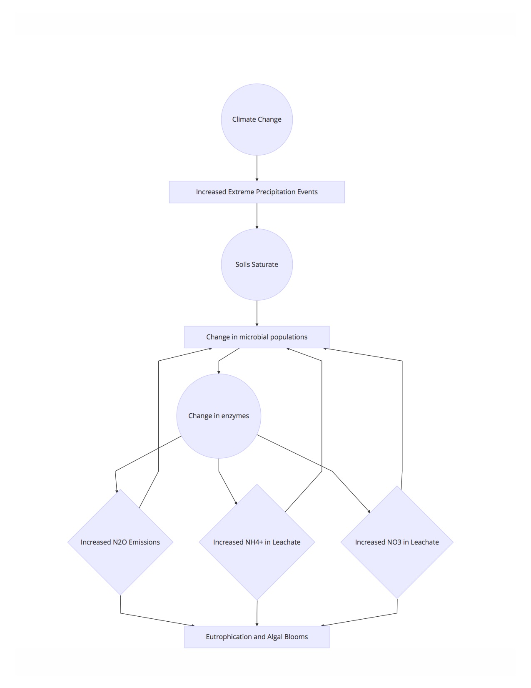

```{r setup, include=FALSE}
knitr::opts_chunk$set(echo = TRUE)
```

##Question 1
####Big Questions
>- What makes an effective riparian buffer?
>- What is the role of soil and soil microorganisms in making an effective or ineffective riparian buffer?
>- How do microorganisms influence nitrogen, phosphorus, and carbon cycling?
>- What makes a resilient and resistent riparian buffer?
>- How does climate change impact processes in riparian buffers?

\bigskip
\bigskip
\bigskip

My experiments and sampling are trying to assess the response of riparian buffer soils of different moisture regimes to extreme precipiation events. The analysis focuses on collecting data about microorganisms such as extracellular enzyme activity over time, nitrous oxide flux, and soil core leachate nutrient concentrations over time.


#####Flow chart describing my research. Climate change impacts the frequency of extreme events which I hypothesize impacts soil microbial populations and therefore enzymatic activity. These things in turn influence nutrient cycling and eutrophication in Lake Champlain. In my research, we apply this model to an agricultural riparian zone.

